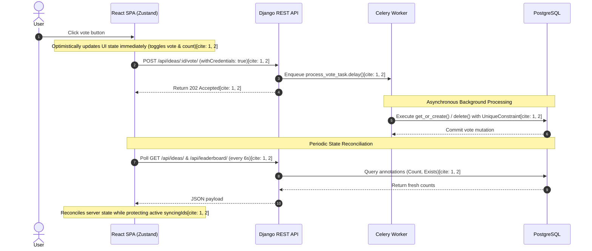

```markdown
# VoteIdeaBoard
by jevon zeev

Internal feature voting app. Team members log in, post ideas, and vote on what to build next.

Full stack portfolio project using Django REST, React, PostgreSQL, Redis, and Celery. Session auth, vote integrity, async writes, optimistic UI, and custom 3D visual components rendered with WebGL/Three.js.


## What this project shows

Session-based auth with no public signup. Ideas are immutable once posted. The main feed stays sorted by date while the leaderboard sorts by vote count. Votes go through Celery so the API stays responsive under load. The React frontend uses Zustand with optimistic updates and polling to stay in sync.

## Architecture & Vote Flow



## Project layout

```
votingboard/
├── api/             Django app (models, views, serializers, tasks)
├── config/            Django settings, Celery, URLs
├── frontend/          React + Vite SPA
├── docker-compose.yml
├── manage.py
├── pyproject.toml     Python deps managed by uv
├── uv.lock
└── setup_env.py       Creates a starter .env

```

## Clone

```bash
git clone [https://github.com/j3vonz3v/voteIdeaBoard.git](https://github.com/j3vonz3v/voteIdeaBoard.git)
cd voteIdeaBoard

```

## Testing

### Unit tests

```bash
uv run python manage.py test api

```

14 tests covering auth, ideas, votes, and the one-vote-per-user database constraint.

### Integration and end-to-end

Not written yet.

## Getting started

Works on Linux, macOS, and Windows (use Git Bash or WSL on Windows for the shell commands).

### 1. Create virtual environment

```bash
uv venv

```

### 2. Install dependencies

Use uv only. Do not use pip directly.

```bash
uv sync

```

### 3. Start PostgreSQL and Redis

```bash
docker compose up -d

```

### 4. Create the .env file

```bash
uv run python setup_env.py

```

Make sure the generated `.env` contains at least:

```env
ALLOWED_HOSTS=127.0.0.1,localhost

```

### 5. Run migrations

```bash
uv run python manage.py migrate

```

### 6. Seed users

Users cannot self-register. Seed them manually.

Default account:

```bash
uv run python manage.py seed

```

Username: `jevon`

Password: `password333`

Custom account:

```bash
uv run python manage.py seed --username alice --password changeme --email alice@WhiteRabbit.com

```

### 7. Quick password check (optional)

```bash
uv run python manage.py shell -c "from django.contrib.auth.models import User; u = User.objects.get(username='jevon'); print(u.check_password('password333'))"

```

Should print `True`.

### 8. Run the backend

Open three terminals.

**Terminal 1 – Django**

```bash
cd voteIdeaBoard
uv run python manage.py runserver

```

**Terminal 2 – Celery worker** (required for votes to actually persist)

```bash
cd voteIdeaBoard
uv run python -m celery -A config worker -l info

```

### 9. Run the frontend

**Terminal 3**

```bash
cd voteIdeaBoard/frontend
npm install
npm run dev

```

Open http://localhost:5173 and log in with a seeded account.

## API examples

All endpoints live under `/api/`. Session cookie auth is required except for login.

### Login

```bash
curl -s -c cookies.txt -X POST [http://127.0.0.1:8000/api/auth/login/](http://127.0.0.1:8000/api/auth/login/) \
  -H "Content-Type: application/json" \
  -d '{"username": "jevon", "password": "password333"}'

```

### Check current session

```bash
curl -s -b cookies.txt [http://127.0.0.1:8000/api/auth/me/](http://127.0.0.1:8000/api/auth/me/)

```

### List ideas

```bash
curl -s -b cookies.txt [http://127.0.0.1:8000/api/ideas/](http://127.0.0.1:8000/api/ideas/)

```

### Create idea

```bash
curl -s -b cookies.txt -X POST [http://127.0.0.1:8000/api/ideas/](http://127.0.0.1:8000/api/ideas/) \
  -H "Content-Type: application/json" \
  -d '{"title": "Dark mode support", "description": "Add dark mode to the dashboard"}'

```

### Vote

Votes are queued to Celery. The API returns immediately with the expected state.

```bash
curl -s -b cookies.txt -X POST [http://127.0.0.1:8000/api/ideas/1/vote/](http://127.0.0.1:8000/api/ideas/1/vote/)

```

Voting again on the same idea is accepted by the API. The database unique constraint prevents a second row from being created.

### Unvote

```bash
curl -s -b cookies.txt -X DELETE [http://127.0.0.1:8000/api/ideas/1/vote/](http://127.0.0.1:8000/api/ideas/1/vote/)

```

### Leaderboard

```bash
curl -s -b cookies.txt [http://127.0.0.1:8000/api/leaderboard/](http://127.0.0.1:8000/api/leaderboard/)

```

### Logout

```bash
curl -s -b cookies.txt -X POST [http://127.0.0.1:8000/api/auth/logout/](http://127.0.0.1:8000/api/auth/logout/)

```

### Confirm session is gone

```bash
curl -s -b cookies.txt [http://127.0.0.1:8000/api/auth/me/](http://127.0.0.1:8000/api/auth/me/)

```

## Status codes

| Code | Meaning |
| --- | --- |
| 200 | Success, data returned |
| 201 | Resource created |
| 202 | Accepted, work queued (votes) |
| 204 | Success, no content |
| 400 | Bad request |
| 403 | Not authenticated or forbidden |
| 404 | Not found |
| 409 | Conflict (database constraint) |

```

```